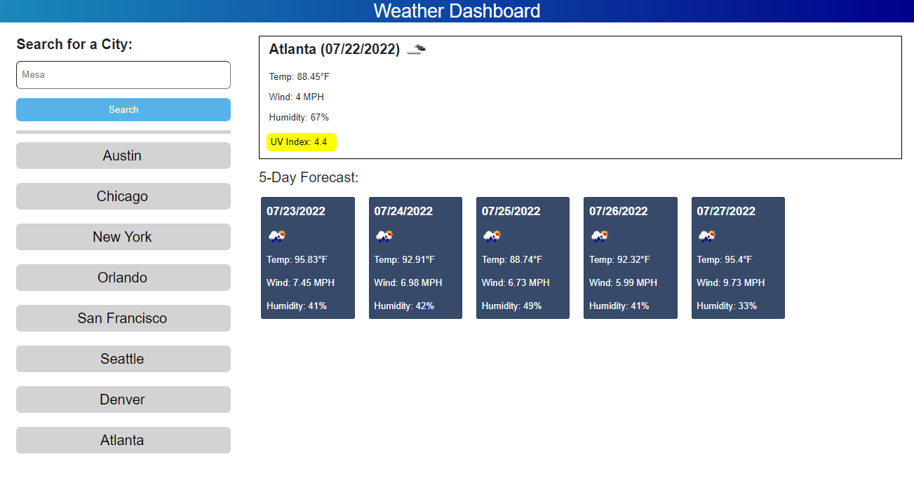

# Weather-Dashboard
## Description
This weather dashboard was built with JQUERY powering HTML and CSS. This dashboard allows you to search by any city name and get the temperature, wind speed, humidity percentage, and the UVIndex. In the previously searched city section, you can click on any city to research the information. Take a look at the 5-day forecast section to get info on the upcoming week.

## Screenshot

## Deployed Application
https://benbushman98.github.io/Weather-Dashboard/
